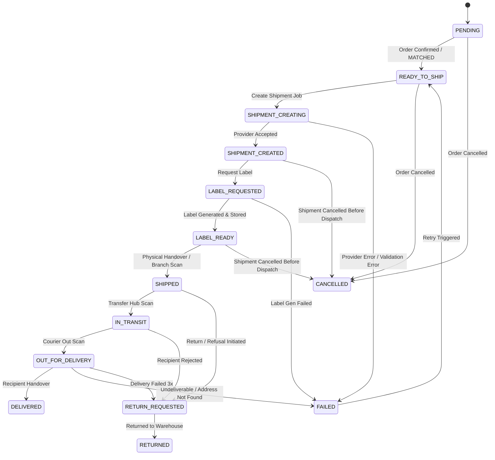

# Shipping State Machine Specification
**ZUULAB E-Commerce Engine — Phase 19**
**Date:** 2026-09-29

---

## 1. Overview

The shipping state machine governs the entire lifecycle of a shipment, whether created from a **Direct Storefront Order** or an ingested, matched **Marketplace Order** (Trendyol, Hepsiburada, etc.).

All state transitions are deterministic, enforced through a single authoritative validation guard, and audited in the immutable event log.

---

## 2. State Definitions

### Complete State Catalog:
1. `PENDING`: Initial state upon creation; awaiting order eligibility.
2. `READY_TO_SHIP`: Order is paid / confirmed and reconciled; inventory is reserved; ready for cargo provider dispatch.
3. `SHIPMENT_CREATING`: Outbound request to cargo provider API is in-flight.
4. `SHIPMENT_CREATED`: Carrier registered shipment and returned tracking number / shipment ID.
5. `LABEL_REQUESTED`: Barcode and label rendering job submitted.
6. `LABEL_READY`: Physical 100×100mm PDF/ZPL/raster label generated, checksummed, and stored.
7. `SHIPPED`: Physical package accepted by carrier branch or picked up by courier. Inventory commit occurs at this stage if not previously committed.
8. `IN_TRANSIT`: Package moving between sorting hubs / transfer centers.
9. `OUT_FOR_DELIVERY`: Package assigned to courier vehicle for delivery today.
10. `DELIVERED`: Package successfully handed to customer.
11. `RETURN_REQUESTED`: Package refused, return requested, or undeliverable.
12. `RETURNED`: Package physically arrived back at sender warehouse.
13. `CANCELLED`: Shipment aborted prior to dispatch.
14. `FAILED`: Unrecoverable error during registration, label generation, or delivery.

---

## 3. Allowed Transition Table

| Current State | Permitted Next States |
| :--- | :--- |
| `PENDING` | `READY_TO_SHIP`, `CANCELLED`, `FAILED` |
| `READY_TO_SHIP` | `SHIPMENT_CREATING`, `CANCELLED`, `FAILED` |
| `SHIPMENT_CREATING` | `SHIPMENT_CREATED`, `FAILED`, `READY_TO_SHIP` (retry) |
| `SHIPMENT_CREATED` | `LABEL_REQUESTED`, `LABEL_READY`, `SHIPPED`, `CANCELLED`, `FAILED` |
| `LABEL_REQUESTED` | `LABEL_READY`, `FAILED` |
| `LABEL_READY` | `SHIPPED`, `CANCELLED`, `LABEL_REQUESTED` (regeneration) |
| `SHIPPED` | `IN_TRANSIT`, `OUT_FOR_DELIVERY`, `DELIVERED`, `RETURN_REQUESTED`, `FAILED` |
| `IN_TRANSIT` | `OUT_FOR_DELIVERY`, `DELIVERED`, `RETURN_REQUESTED`, `FAILED` |
| `OUT_FOR_DELIVERY` | `DELIVERED`, `RETURN_REQUESTED`, `FAILED` |
| `DELIVERED` | `RETURN_REQUESTED` (customer return window) |
| `RETURN_REQUESTED` | `RETURNED`, `IN_TRANSIT`, `FAILED` |
| `RETURNED` | *(Terminal)* |
| `CANCELLED` | *(Terminal)* |
| `FAILED` | `READY_TO_SHIP`, `LABEL_REQUESTED`, `CANCELLED` |

---

## 4. Invariants & Business Rules

1. **Deterministic Order Reconciliation Guard**:
   Marketplace orders with status `UNMATCHED` or `PARTIALLY_MATCHED` are strictly rejected by `validateShipmentEligibility`. Only `MATCHED` orders may enter `READY_TO_SHIP`.
2. **Inventory Safety**:
   Transitions to `LABEL_READY` or `LABEL_REQUESTED` do NOT modify inventory.
   Transition to `SHIPPED` commits physical inventory (`commitInventoryReservation`).
   Transition to `CANCELLED` releases reservations (`releaseInventoryReservation`) if still reserved.
3. **Idempotency Guard**:
   If a webhook or tracking poll receives a status that matches the current status, the transition is recorded as `UNCHANGED` and ignored without errors or duplicate events.
4. **Unknown Status Protection**:
   If a carrier webhook passes an unrecognized status text, the raw event is safely recorded in `ShippingWebhookEvent` and marked `REVIEW_REQUIRED`, without crashing the webhook or causing an illegal state transition.
